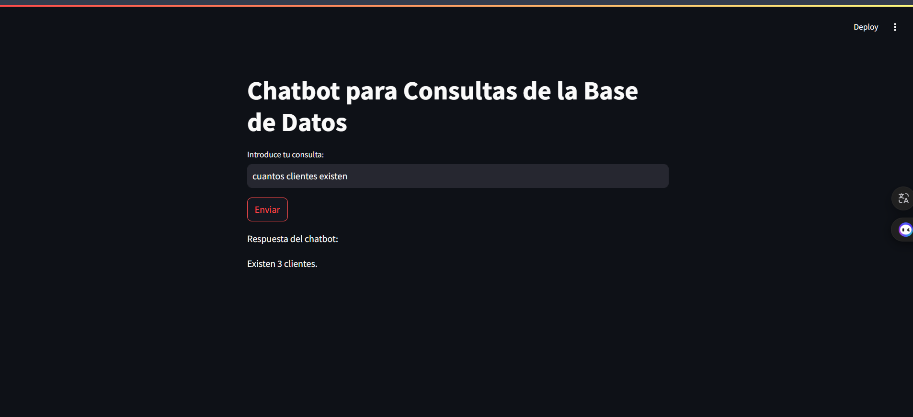
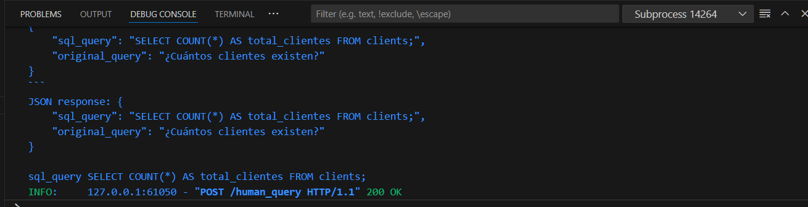

# Aplicación de Preguntas y Respuestas con LLM y SQL

## Resumen

Esta aplicación utiliza un modelo de lenguaje grande (LLM) para generar consultas SQL a partir de preguntas en lenguaje natural. La aplicación se compone de dos partes: una interfaz de usuario creada con Streamlit y un servidor FastAPI que ejecuta las consultas SQL generadas por el LLM.

## Flujo de trabajo

1. **Pregunta en lenguaje natural**: El usuario ingresa una pregunta en lenguaje natural a través de la interfaz de usuario de Streamlit.
2. **Obtención del schema de la base de datos**: El LLM obtiene el schema de la base de datos para entender la estructura de los datos.
3. **Generación de la consulta SQL**: El LLM utiliza el schema de la base de datos y la pregunta en lenguaje natural para generar una consulta SQL que responda a la pregunta.
4. **Ejecución de la consulta SQL**: La consulta SQL generada por el LLM se ejecuta en la base de datos.
5. **Resultado**: El resultado de la consulta SQL se muestra al usuario a través de la interfaz de usuario de Streamlit.

## Requisitos previos

* Tener instalado Streamlit y FastAPI -> pip install -r requirements.txt
* Tener una base de datos configurada y accesible.

## Instrucciones para ejecutar la aplicación

1. Ejecuta `streamlit run streamlit_app.py` en un terminal separado para iniciar la interfaz de usuario de Streamlit.
2. Asegúrate de que el servidor FastAPI esté en ejecución para que Streamlit pueda enviar las consultas SQL. Puedes hacer esto ejecutando `uvicorn main:app --reload` en un terminal separado.

## Notas

* Asegúrate de que el LLM esté configurado correctamente y tenga acceso a la base de datos.
* La aplicación puede requerir ajustes adicionales para funcionar correctamente en tu entorno específico.

